# **README**
- **PBR**

  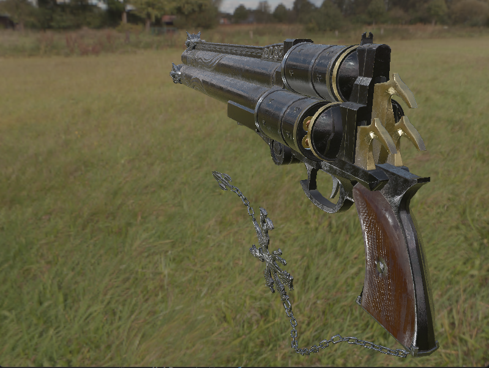
  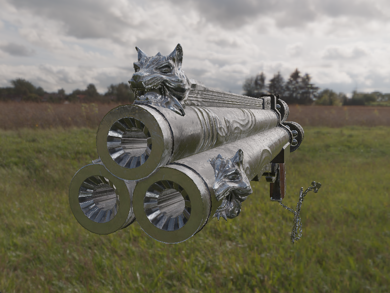
  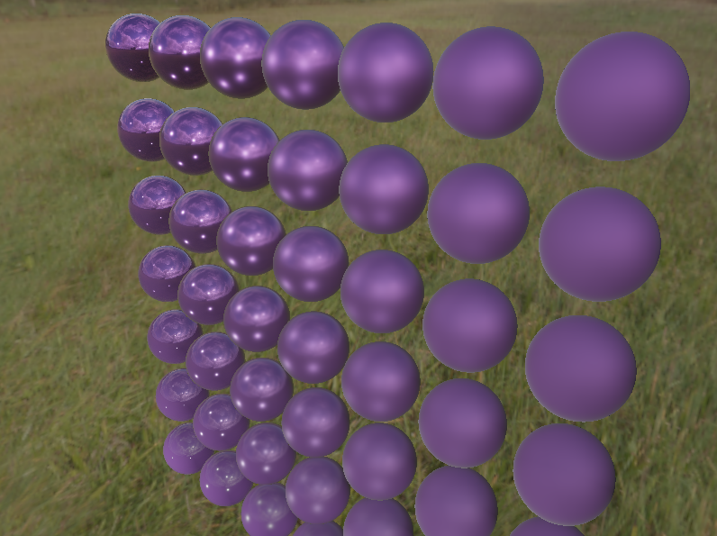
  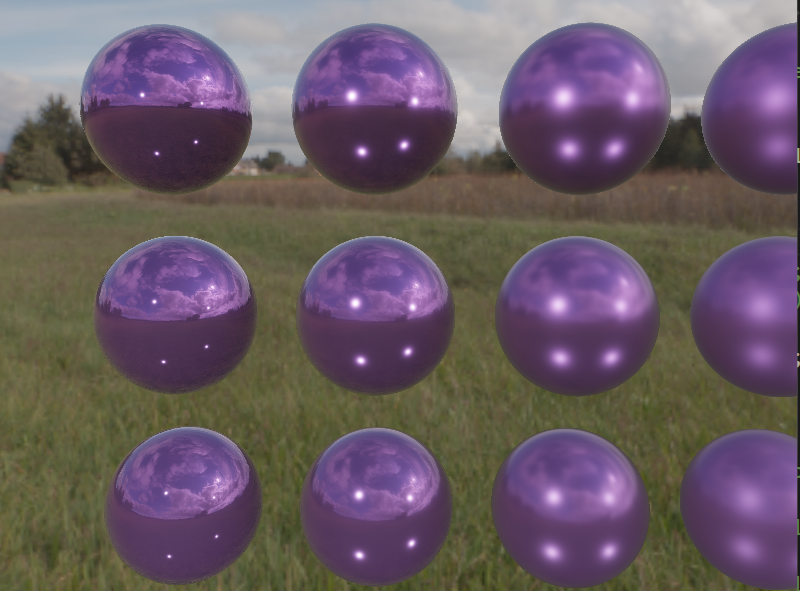

- **SSAO**

  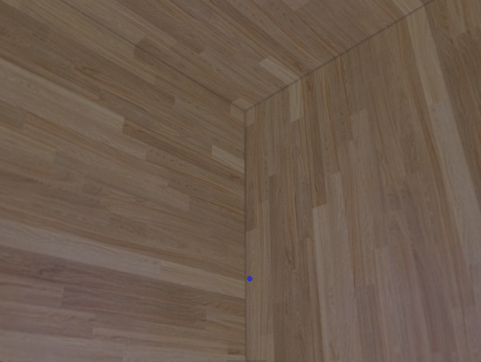
  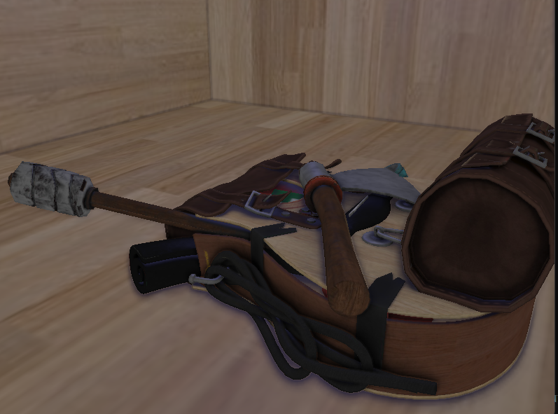

- **Shadow Render**

  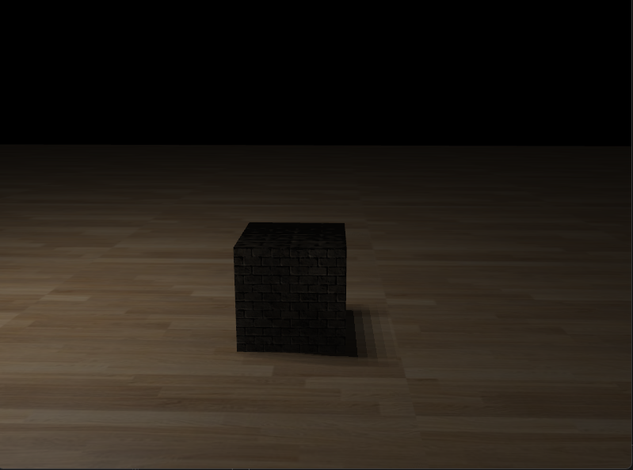
  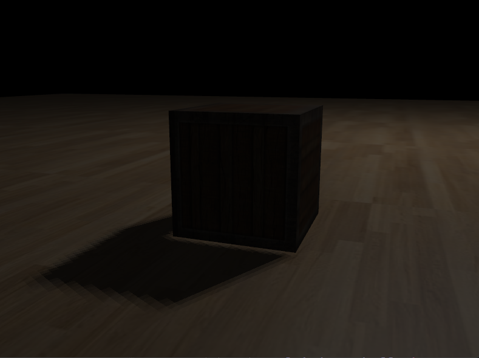

- **Deferred Render**

  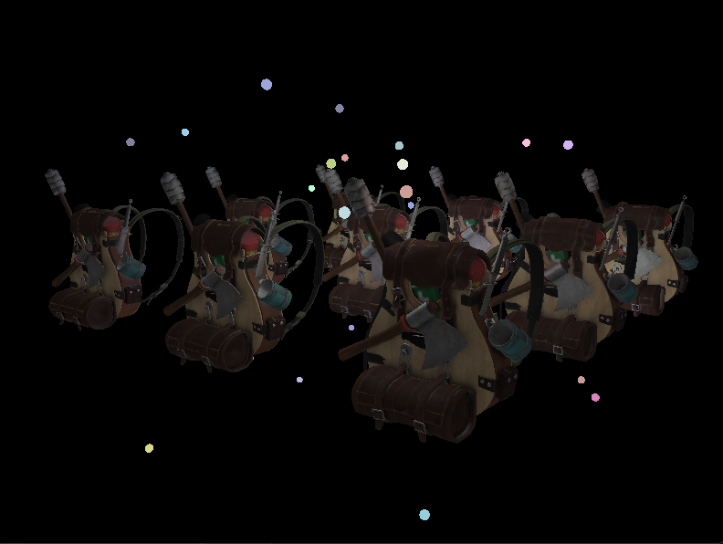

- **Instancing (10000+Objs, 120+FPS)**

  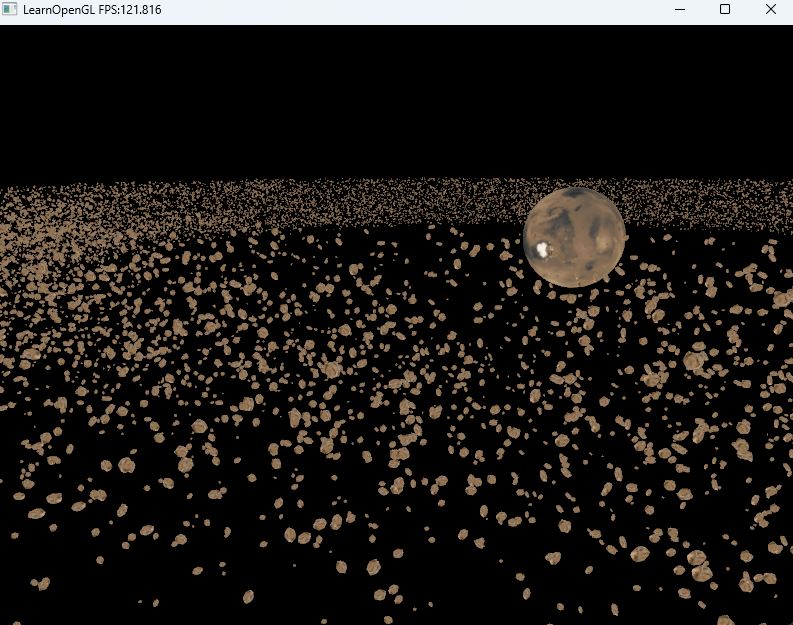

- **Skybox**

  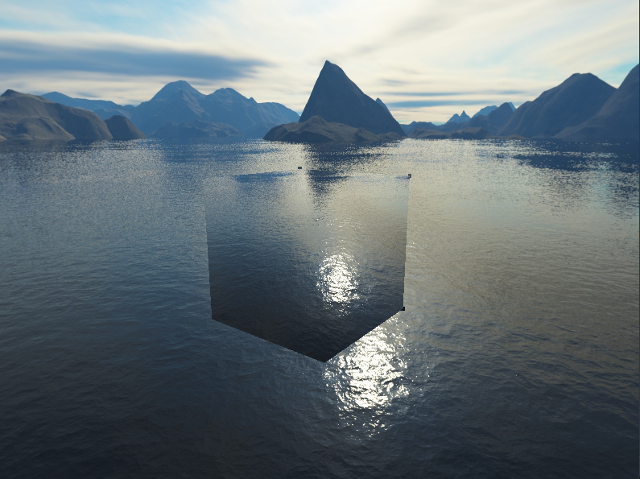

- **Parallax**

  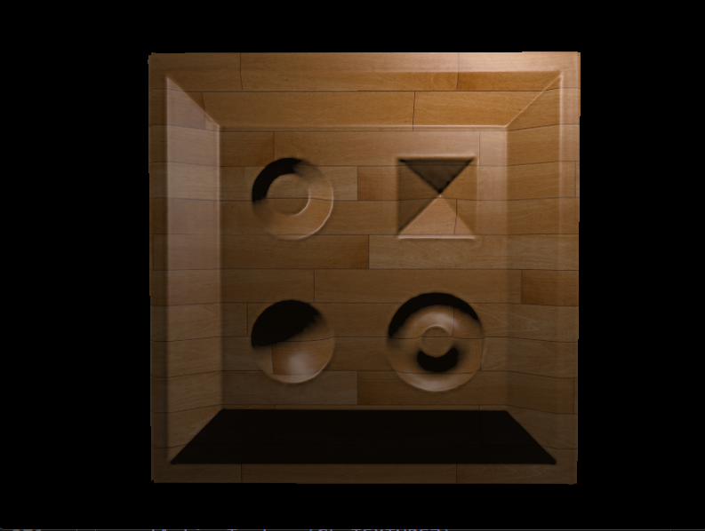
  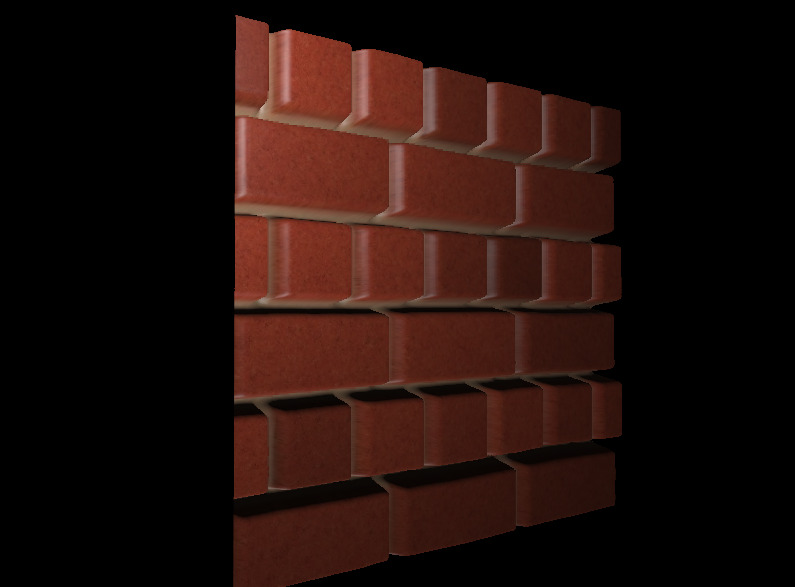
  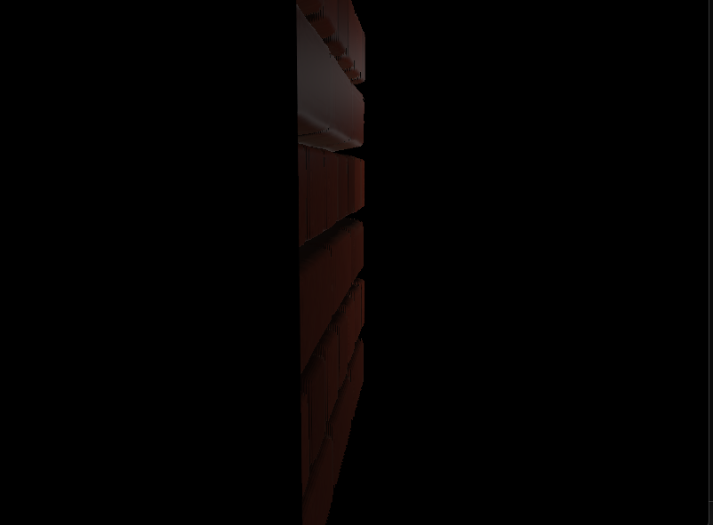

- **HDR with Bloom & AA (Anti-Aliasing)**

  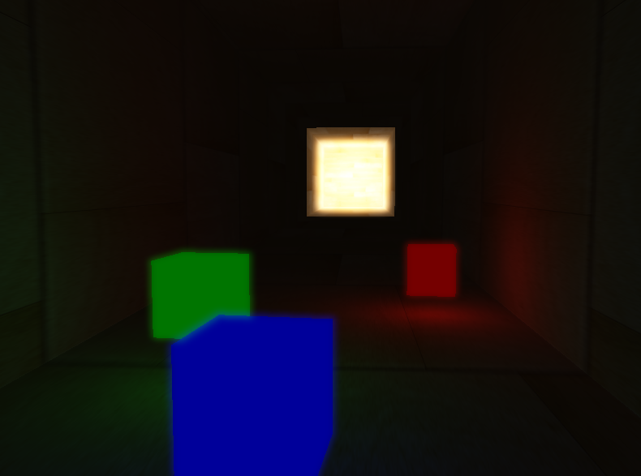
  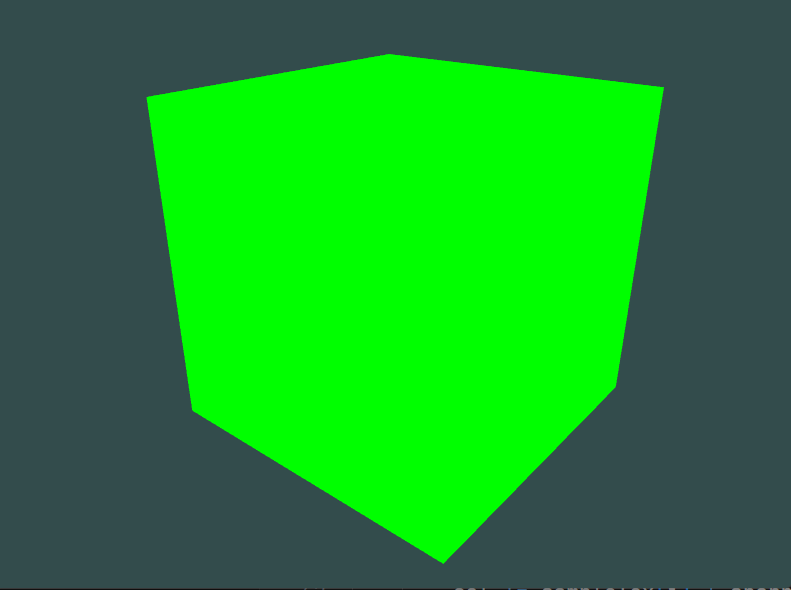

- **Advanced GLSL & Postprocess**

  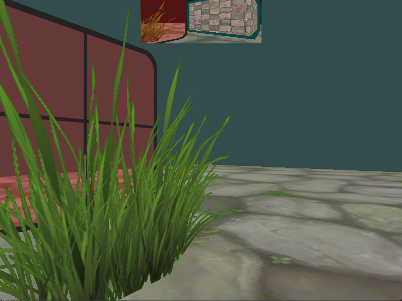
  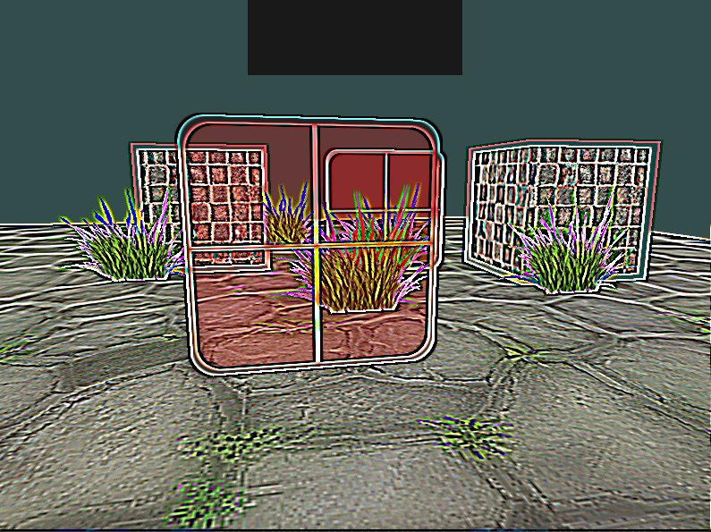

## 项目简介 (Project Overview)
这是一个基于OpenGL实现的个人3D图形渲染引擎项目。本仓库记录了我从基础概念到高级技术的学习历程，所有实现均严格遵循教程目录，旨在通过实践深入掌握现代图形渲染管线，包括但不限于以下几大主要实现内容 (Key Features)。
## 1. 入门 (Introduction)
- OpenGL 基础 (Getting Started with OpenGL): 实现了窗口创建、基本着色器（Shaders）和纹理（Textures）。
- 坐标系统 (Coordinate Systems): 实现了模型（Model）、视图（View）和投影（Projection）变换，以及摄像机（Camera）控制。
## 2. 光照 (Lighting)
- 基础光照 (Basic Lighting): 实现了多种光源（点光源、定向光、聚光灯），以及材质（Materials）和光照贴图（Lighting maps）。
## 3. 模型加载 (Model Loading)
- 模型加载 (Model Loading): 使用 Assimp 库实现了复杂3D模型的加载和渲染，包括网格（Mesh）和材质的解析。

## 4. 高级OpenGL特性 (Advanced OpenGL)
- 帧缓冲 (Framebuffers): 实现了帧缓冲，为后处理（Post-processing）效果奠定基础。
- 立方体贴图 (Cubemaps): 实现了天空盒（Skybox）和环境映射。
- 几何着色器 (Geometry Shader): 实现了几何体着色器以生成新的图元。
- 实例化渲染 (Instancing): 实现了硬件实例化，高效渲染大量相同物体。

## 5. 高级光照渲染 (Advanced Lighting)
- 高级光照 (Advanced Lighting): 实现了更复杂的渲染技术。
- 伽马校正 (Gamma Correction): 实现了伽马校正，确保光照效果更真实。
- 阴影 (Shadows): 实现了阴影映射，为场景添加深度和真实感。
- 法线贴图 (Normal Mapping) & 视差贴图 (Parallax Mapping): 实现了法线贴图和视差贴图，增加物体表面的细节。
- HDR & Bloom: 实现了高动态范围（HDR）渲染和泛光（Bloom）效果。
- 延迟着色 (Deferred Shading): 实现了延迟着色技术，高效处理大量光源。
- 环境光遮蔽 (SSAO): 实现了屏幕空间环境光遮蔽（SSAO），增强阴影细节。

## 6. 基于物理的渲染 (PBR)
- 理论与实现 (Theory & Implementation): PBR 理论 (PBR Theory): 深入理解了 PBR 的核心理论。
- 光照计算 (Lighting): 基于 PBR 实现了更真实的光照计算。
- 基于图像的光照 (IBL): 实现了基于图像的光照（IBL），为场景提供更加真实的环境光照。
- PBR + IBL + direct Light 光照系统的实现。
    
## 如何运行 (How to Run)：
本项目基于Microsoft Visual Studio 2022， C++23编写；
依赖以下库：GLFW3，GLAD，Assimp，stb_image；
Shader（着色器）考虑到兼容性和渲染特性，均使用#version 330，能达到一个不错的渲染效果。

欢迎任何对图形学感兴趣的朋友进行交流和贡献！
